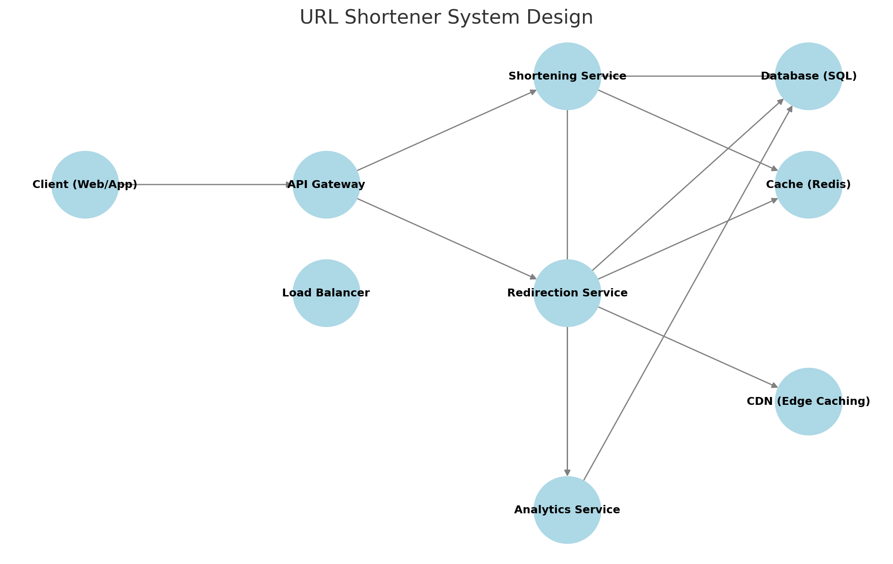

### **Detailed System Design: URL Shortener (Bit.ly, TinyURL)**  

## **1. Requirements Analysis**  

### **Functional Requirements**  
✅ Shorten a long URL to a unique short URL.  

✅ Redirect users to the original URL when accessing the short URL.  

✅ Track statistics (clicks, location, device, etc.).  

✅ Support custom short URLs.  

✅ Support URL expiry.  

### **Non-Functional Requirements**  
✅ High availability and low latency.  

✅ Scalable to handle millions of requests.  

✅ Prevent URL collisions.  

✅ Fast redirections (sub-10ms).  

## **2. High-Level Architecture**  

### **Key Components**
1. **Client (Web/App API)**
   - Users submit long URLs to shorten.
   - Users access short URLs to be redirected.

2. **API Gateway**
   - Handles HTTP requests.
   - Routes API calls to the correct service.
   - Load balances requests across backend servers.

3. **Shortening Service (Backend)**
   - Generates and stores short URLs.
   - Ensures uniqueness via **Base62 encoding**.
   - Checks for **custom URLs** and **expiry**.

4. **Database**
   - Stores **(short_key → original_url, metadata)**.
   - Supports **sharding** and **replication**.

5. **Caching (Redis)**
   - Stores **frequently accessed short URLs**.
   - Reduces database queries.

6. **Redirection Service**
   - Fetches the original URL (cache or DB).
   - Redirects user.

7. **Analytics & Logging**
   - Tracks URL usage (clicks, device, region).


## **3. Database Schema**  

Using **SQL (PostgreSQL/MySQL)** for structured data:  

```sql
CREATE TABLE urls (
    id BIGINT AUTO_INCREMENT PRIMARY KEY,
    short_key VARCHAR(8) UNIQUE NOT NULL,
    original_url TEXT NOT NULL,
    created_at TIMESTAMP DEFAULT CURRENT_TIMESTAMP,
    expires_at TIMESTAMP NULL,
    user_id BIGINT NULL
);
```

For analytics tracking:

```sql
CREATE TABLE url_clicks (
    id BIGINT AUTO_INCREMENT PRIMARY KEY,
    short_key VARCHAR(8),
    clicked_at TIMESTAMP DEFAULT CURRENT_TIMESTAMP,
    ip_address VARCHAR(45),
    user_agent TEXT
);
```

## **4. URL Shortening Logic**  

### **1. Generate a Unique Short Key**
#### **Base62 Encoding**
- Converts the URL ID into a **6-8 character** alphanumeric string.
- Uses **A-Z, a-z, 0-9** for compact representation.
- Example: `123456` → `dX9A3B`

#### **Hashing Algorithm (Fallback)**
- If Base62 leads to a **collision**, apply **SHA-256 + truncate**.
- Store hash collisions in **separate retry logic**.

### **2. Store in Database**
- Check if **URL exists** to avoid duplicates.
- Insert `(short_key → original_url, created_at, expires_at)`.

### **3. Redirect Users**
- On access, **check Redis** for short_key:
  - If **found**, redirect instantly.
  - If **not found**, fetch from **DB**, store in cache, redirect.


## **5. Caching Strategy (Redis)**
### **Why?**
- Reduce DB lookups.
- Handle frequent redirects efficiently.

### **What to Cache?**
- **Key:** `short_key`
- **Value:** `original_url`
- **TTL:** 24 hours (for popular links)

### **Cache Miss Handling**
- If not in cache, query DB, store result in Redis.

```python
# Pseudocode for redirect logic
def get_original_url(short_key):
    url = redis.get(short_key)
    if url:
        return url
    else:
        url = db.query("SELECT original_url FROM urls WHERE short_key = ?", short_key)
        redis.setex(short_key, 86400, url)  # Cache for 24 hours
        return url
```

---

## **6. Scaling Strategies**  

### **Database Scaling**
- **Sharding:** Short_key hash **mod(N servers)** to distribute data.
- **Read Replicas:** For high read traffic.
- **Partitioning:** Time-based partitioning for expiry cleanup.

### **Load Balancing**
- **Nginx / AWS ALB** to distribute traffic across API servers.

### **CDN & Edge Caching**
- **Cloudflare, Akamai** for global caching of static URLs.
- Edge caching improves **latency**.

### **Background Jobs (Async Processing)**
- **URL expiry cleanup** (delete expired entries).
- **Batch analytics processing** (click logs).

## **7. Security Considerations**  

| **Issue** | **Solution** |
|-----------|-------------|
| URL enumeration (predictable URLs) | Use random Base62 encoding. |
| Phishing prevention | Blacklist known spam domains. |
| Rate limiting | Use **token bucket** or **Redis Leaky Bucket**. |
| Data consistency | Use **strong consistency** for writes. |


## **8. System Design Diagram**  

Here is a **detailed system design diagram** for the URL shortener, showcasing how the components interact.



## **9. Miscellaneous**
### **9.1 Hashing Algorithm Fallback: SHA-256 + Truncate**
When using **Base62 encoding**, we may encounter **collisions** (i.e., the same short key being generated for different URLs). To handle this, we use a **fallback hashing method** such as **SHA-256** and then truncate it to obtain a unique, deterministic short key.


#### **1. Steps for Generating a Short URL with SHA-256 + Truncate**
1. **Hash the URL using SHA-256.**
2. **Convert the hash to Base62 encoding.**
3. **Truncate the hash to a fixed length (e.g., 6-8 characters).**
4. **Check for collisions in the database.**
5. If a collision exists, **append a counter** and rehash.


#### **2. Example of SHA-256 Hashing + Truncation**
##### **Example Input**
Original long URL:  
`https://www.example.com/my-very-long-url-that-needs-shortening`

##### **Step 1: Generate SHA-256 Hash**
SHA-256 of the URL:

```
3f8b31cf32a1e2d72e8adbd30f63e22c23d20a2eaf9a6a44f312f8f9f1f6236b
```

##### **Step 2: Convert to Base62**
Convert this **hexadecimal SHA-256 hash** to Base62:

```
"Gh3F2aB7kLp"
```

##### **Step 3: Truncate the Key**
Take the **first 6 characters** of the Base62 string:

```
"Gh3F2a"
```

##### **Step 4: Check for Collision**
- If `"Gh3F2a"` **already exists** in the database, append a counter (`1`, `2`, etc.), rehash, and retry.


#### **3. Pseudocode for SHA-256 + Truncate**
```python
import hashlib
import base64

def generate_short_key(url, length=6):
    # Step 1: Create SHA-256 hash of the URL
    sha256_hash = hashlib.sha256(url.encode()).hexdigest()
    
    # Step 2: Convert hex to integer
    hash_int = int(sha256_hash, 16)
    
    # Step 3: Convert integer to Base62
    base62_chars = "0123456789ABCDEFGHIJKLMNOPQRSTUVWXYZabcdefghijklmnopqrstuvwxyz"
    base62_string = ""
    
    while hash_int > 0:
        base62_string = base62_chars[hash_int % 62] + base62_string
        hash_int //= 62

    # Step 4: Truncate and return
    short_key = base62_string[:length]
    return short_key

# Example Usage
long_url = "https://www.example.com/my-very-long-url-that-needs-shortening"
short_key = generate_short_key(long_url)
print("Short URL Key:", short_key)
```


#### **4. Handling Collisions**
- If a collision is detected (i.e., the short key **already exists** in the database), we:
  1. Append a **unique counter** to the original URL before hashing.
  2. Retry the hashing process.

**Example:**
1. `"https://example.com"` → `"Gh3F2a"`
2. **Collision detected** in DB.
3. Retry with `"https://example.com1"` → `"Xb7A3D"`


#### **5. Advantages of SHA-256 + Truncate**
✅ **Ensures uniqueness** (SHA-256 is cryptographically strong).  

✅ **Avoids collisions** when combined with retries.  

✅ **Fast and deterministic** (same input always gives the same short key).  


This method ensures that **short URLs remain unique and scalable**, even when handling **millions of requests**. Let me know if you need a deeper explanation!

### **9.2 Maximum Unique Short Codes in Base62 (6-character key)**  

* Base62 uses **A-Z (26), a-z (26), and 0-9 (10)**, meaning **62** unique characters.  

* For a **6-character short code**, the total number of unique codes is: [62^6]

* The maximum number of unique short codes that can be generated using a **6-character Base62 encoding** is **56,800,235,584** (approximately **56.8 billion**).  

* This means that a URL shortener can **handle up to 56.8 billion unique URLs** before running out of unique keys. If this limit is approached, increasing the key length to **7 characters** will significantly expand the capacity.

### **9.3 Sharding: Short_key Hash Mod (N Servers) for Distribution**
Sharding is used to **distribute database records** across multiple servers to handle large-scale traffic efficiently. Instead of storing all short URLs in a single database, we **split data across multiple databases (shards)**.

#### **🔹 How Does It Work?**
We use the **modulus operation (`%`)** on the hashed `short_key` to determine which shard (database) will store a given entry.

1. Compute the **hash** of the `short_key`.
2. Apply modulo operation with the number of database shards (`N`).
3. Store the data in the corresponding **shard**.

#### **🔹 Formula**
\[
\text{Shard Number} = \text{Hash}(\text{short_key}) \mod N
\]
Where:
- `short_key` is the **unique URL identifier**.
- `N` is the **number of database shards**.


#### **🔹 Example**
**Assume 4 database shards (`N = 4`).**
1. **Short key: "abc123"**
   - Hash("abc123") → `123456789`
   - `123456789 % 4 = 1` → Stored in **Shard 1**.

2. **Short key: "xyz789"**
   - Hash("xyz789") → `987654321`
   - `987654321 % 4 = 3` → Stored in **Shard 3**.


#### **🔹 Advantages**
✅ **Even distribution** of data across `N` databases.  

✅ **Parallel processing** increases system throughput.  

✅ **Easy to scale** (add more shards dynamically).  

#### **🔹 Challenges**
⚠️ **Shard rebalancing issue**: If `N` changes, all entries need re-hashing.  
⚠️ **Cross-shard queries are complex**: Requires an indexing service (e.g., Elasticsearch) to fetch records across shards.  

#### **🔹 Solution for Rebalancing**
Use **Consistent Hashing** instead of `mod N`, so adding new shards **doesn't require re-hashing** all previous records.

### **9.4. Partitioning: Time-Based Partitioning for Expiry Cleanup**
Partitioning divides **database tables into smaller chunks** (partitions) for better **query performance and data management**. In a **URL shortener**, we can use **time-based partitioning** to **manage expired links** efficiently.

#### **🔹 How Does It Work?**
- Instead of storing all URLs in **one large table**, we create **separate partitions** for different time ranges (e.g., monthly, yearly).
- Expired URLs can be **quickly dropped** by deleting entire partitions.

#### **🔹 Example Partitioning Strategy**
Assume we use **monthly partitioning**:
1. **Partition for January 2025:**
   ```sql
   CREATE TABLE urls_2025_01 PARTITION OF urls
   FOR VALUES FROM ('2025-01-01') TO ('2025-02-01');
   ```
2. **Partition for February 2025:**
   ```sql
   CREATE TABLE urls_2025_02 PARTITION OF urls
   FOR VALUES FROM ('2025-02-01') TO ('2025-03-01');
   ```
3. **Query Optimization:**
   ```sql
   SELECT * FROM urls WHERE created_at >= '2025-01-01' AND created_at < '2025-02-01';
   ```
   - Queries automatically **scan fewer rows** → Faster results.

4. **Dropping Expired URLs:**
   ```sql
   DROP TABLE urls_2024_12;
   ```
   - This instantly **removes all expired URLs** instead of running slow `DELETE` queries.

#### **🔹 Advantages**
✅ **Improves performance** → Only relevant partitions are scanned.  

✅ **Efficient expiry cleanup** → Dropping old partitions is **instant**.  

✅ **Speeds up deletion** → No need for costly `DELETE` operations.  

#### **🔹 Challenges**
⚠️ **Partition management overhead** → Needs proper indexing.  
⚠️ **Choosing partition granularity** → Monthly may be too coarse, weekly may be too fine.  


### **9.5 💡 When to Use Sharding vs. Partitioning?**
| Feature         | **Sharding** | **Partitioning** |
|---------------|------------|--------------|
| **Goal** | Scale horizontally (distribute across databases) | Improve query performance within a database |
| **Method** | Split data across multiple databases | Split table into smaller partitions |
| **Use Case** | Handle **large volume of traffic** | Optimize **query performance & expiry cleanup** |
| **Example** | Store short URLs in **multiple DBs** | Store **old URLs in separate partitions** |

#### **Conclusion**
- **Sharding (Short_key Hash % N)** → Distributes URLs across multiple databases for **scalability**.
- **Partitioning (Time-based)** → Organizes **expired links** efficiently to speed up cleanup.
- **Both can be used together** in a **high-scale URL shortener**.

---

## **10. Capacity Estimation & Performance**

### **Traffic Estimation**

**Assumptions:**
- 100 million URLs created per month
- Read:Write ratio = 100:1 (100x more redirects than URL creations)

**Write Requests (URL Creation):**
```
100M URLs/month ÷ 30 days ÷ 24 hours ÷ 3600 seconds
= 100,000,000 ÷ 2,592,000
≈ 38.5 requests/second (avg)
Peak traffic (3x avg) ≈ 115 requests/second
```

**Read Requests (Redirects):**
```
38.5 writes/sec × 100 (read:write ratio)
= 3,850 requests/second (avg)
Peak traffic (3x avg) ≈ 11,550 requests/second
```

### **Storage Estimation**

**Per URL Storage:**
```
short_key: 8 bytes (VARCHAR(8))
original_url: ~200 bytes (average)
created_at: 8 bytes (TIMESTAMP)
expires_at: 8 bytes (TIMESTAMP)
user_id: 8 bytes (BIGINT)

Total per URL: ~232 bytes ≈ 250 bytes (with overhead)
```

**Total Storage for 10 Years:**
```
100M URLs/month × 12 months × 10 years = 12 billion URLs
12B URLs × 250 bytes = 3 TB
```

**With Analytics (Click Tracking):**
```
Assume 10 clicks/URL on average
12B URLs × 10 clicks = 120 billion clicks

Per click:
short_key: 8 bytes
clicked_at: 8 bytes
ip_address: 16 bytes (IPv6)
user_agent: ~100 bytes

Total per click: ~132 bytes ≈ 150 bytes (with overhead)

120B clicks × 150 bytes = 18 TB
```

**Total Storage: 3 TB (URLs) + 18 TB (analytics) = 21 TB**

### **Bandwidth Estimation**

**Incoming (URL Creation):**
```
38.5 requests/sec × 250 bytes = 9,625 bytes/sec ≈ 10 KB/sec
Peak: 115 req/sec × 250 bytes ≈ 30 KB/sec
```

**Outgoing (Redirects):**
```
Average redirect response size: ~500 bytes (HTTP 301 + headers)
3,850 requests/sec × 500 bytes = 1,925,000 bytes/sec ≈ 1.9 MB/sec
Peak: 11,550 req/sec × 500 bytes ≈ 5.7 MB/sec
```

### **Cache Memory Estimation**

**Caching Strategy:** Cache 20% of daily traffic (80/20 rule - 20% of URLs get 80% of traffic)

**Daily Requests:**
```
3,850 req/sec × 86,400 seconds = 332,640,000 redirects/day
```

**Unique URLs to cache (assuming 20% of daily traffic):**
```
Assume 10M unique URLs accessed per day
Cache top 20%: 2M URLs
2M URLs × 250 bytes = 500 MB
```

**Redis Memory Needed: ~500 MB to 1 GB (with overhead)**

### **Server Estimation**

**API Servers:**
```
Assuming each server handles 1,000 req/sec:
Peak traffic: 11,550 req/sec ÷ 1,000 = 12 servers

With redundancy (2x for failover): 24 servers
```

**Database Servers:**
```
Assuming sharding across 8 shards:
Each shard handles: 11,550 ÷ 8 ≈ 1,444 req/sec

With read replicas (3 replicas per shard):
Total DB servers: 8 shards × 4 (1 primary + 3 replicas) = 32 servers
```

### **Performance Metrics**

**Target Latency:**
- URL creation: < 100ms
- Redirection: < 10ms (with cache)
- Redirection: < 50ms (without cache)

**Availability Target: 99.9% uptime** (43.8 minutes downtime per month)

**Cache Hit Ratio Target: 80-90%**

---

## **11. Interview Questions & Answers**

### **Common Follow-up Questions**

#### **Q1: How do you handle URL collisions?**

**A:** We use **Base62 encoding** with auto-incrementing IDs, which makes collisions extremely rare. If using SHA-256 hashing, we:
1. Check if short_key exists in database
2. If collision detected, append counter to original URL and rehash
3. Retry until unique key found

Alternatively, use a **distributed ID generator** (like Twitter Snowflake) to guarantee unique IDs before Base62 encoding.

---

#### **Q2: How do you prevent abuse (malicious users creating millions of short URLs)?**

**A:** Implement multiple defense layers:
1. **Rate Limiting:**
   - Per IP: 10 URLs/hour for anonymous users
   - Per user account: 100 URLs/hour
   - Use Redis with sliding window algorithm

2. **CAPTCHA:** Require for anonymous users after 5 URLs

3. **URL Validation:**
   - Blacklist known spam domains
   - Check against URL reputation services
   - Limit URL length (max 2048 characters)

4. **Authentication:** Require user accounts for high-volume use

---

#### **Q3: How do you scale reads vs. writes differently?**

**A:** Reads and writes have different scaling strategies:

**Scaling Reads (100x more traffic):**
- **Caching Layer:** Redis caches 80-90% of requests
- **CDN:** Edge caching for geographic distribution
- **Read Replicas:** 3-5 replicas per database shard
- **Load Balancers:** Distribute traffic across API servers

**Scaling Writes:**
- **Database Sharding:** Distribute writes across multiple shards
- **Async Processing:** Queue analytics writes for batch processing
- **Write-optimized DBs:** Use fast primary nodes with SSD storage

---

#### **Q4: What happens if the cache goes down?**

**A:** **Graceful degradation:**
1. API servers detect Redis is down (health checks)
2. Fallback to direct database queries
3. Response time increases from 10ms → 50ms
4. Alert engineers immediately
5. Auto-scaling triggers more API servers to handle load

**Prevention:**
- **Redis Cluster:** 3-5 node cluster with replication
- **Redis Sentinel:** Automatic failover
- **Circuit Breaker:** Prevent cascading failures

---

#### **Q5: How do you handle custom short URLs (vanity URLs)?**

**A:** Allow users to specify custom aliases:

```python
def create_short_url(original_url, custom_alias=None):
    if custom_alias:
        # Validate custom alias
        if not is_valid_alias(custom_alias):
            return error("Invalid characters or length")

        # Check if already taken
        if db.exists(custom_alias):
            return error("Alias already taken")

        short_key = custom_alias
    else:
        short_key = generate_base62_key()

    db.insert(short_key, original_url)
    return short_key
```

**Constraints:**
- 6-20 characters
- Alphanumeric only
- Profanity filter
- Reserved keywords (admin, api, etc.)

---

#### **Q6: How do you implement URL expiration?**

**A:** Two approaches:

**1. Lazy Deletion (Efficient):**
```python
def get_original_url(short_key):
    url_data = db.query(short_key)

    # Check if expired
    if url_data.expires_at and url_data.expires_at < now():
        return error("URL expired", 404)

    return url_data.original_url
```

**2. Active Cleanup (Background Job):**
```python
# Cron job runs daily
def cleanup_expired_urls():
    # Using time-based partitioning
    old_partition = "urls_" + last_month
    db.drop_partition(old_partition)

    # Or bulk delete
    db.execute("DELETE FROM urls WHERE expires_at < NOW() - INTERVAL '1 month'")
```

Use **lazy deletion** for performance + **periodic cleanup** to reclaim storage.

---

#### **Q7: How do you track analytics without slowing down redirects?**

**A:** **Async analytics processing:**

```python
def redirect(short_key):
    # 1. Get URL from cache/DB (fast path)
    original_url = get_original_url(short_key)

    # 2. Queue analytics event (async, non-blocking)
    analytics_queue.send({
        "short_key": short_key,
        "timestamp": now(),
        "ip": request.ip,
        "user_agent": request.user_agent
    })

    # 3. Redirect immediately (don't wait for analytics)
    return redirect(original_url, 301)

# Background worker processes analytics
def analytics_worker():
    while True:
        event = analytics_queue.receive()
        db.insert_analytics(event)
```

**Benefits:**
- Redirect latency stays under 10ms
- Analytics processed in batches
- Can handle analytics system failures without affecting redirects

---

#### **Q8: Should you use HTTP 301 or 302 for redirects?**

**A:** Depends on the use case:

**HTTP 301 (Permanent Redirect):**
- Browsers cache the redirect
- Faster for repeat visitors (no server hit)
- **Problem:** Can't track analytics after first visit

**HTTP 302 (Temporary Redirect):**
- Browsers don't cache
- Every click hits server (trackable)
- Slower but better for analytics

**Best Practice:** Use **302** for URL shorteners to track every click.

---

#### **Q9: How would you implement a QR code generator for short URLs?**

**A:** Generate QR codes on-demand or pre-generate:

**On-Demand Generation:**
```python
from qrcode import make

@app.get("/api/v1/qr/:short_key")
def generate_qr(short_key):
    url = f"https://short.ly/{short_key}"
    qr_image = make(url)
    return qr_image.to_png()
```

**Pre-Generation (Faster):**
```python
def create_short_url(original_url):
    short_key = generate_key()
    db.insert(short_key, original_url)

    # Generate and store QR code
    qr_image = make(f"https://short.ly/{short_key}")
    s3.upload(f"qr/{short_key}.png", qr_image)

    return short_key
```

Cache QR codes in CDN for fast delivery.

---

#### **Q10: How do you migrate from one hashing algorithm to another?**

**A:** **Dual-write strategy** for zero-downtime migration:

**Phase 1: Dual Write**
```python
def create_short_url(url):
    # Old algorithm (existing)
    old_key = base62_encode(id)

    # New algorithm (migration)
    new_key = sha256_truncate(url)

    # Write both
    db.insert(old_key, url, algorithm="base62")
    db.insert(new_key, url, algorithm="sha256")
```

**Phase 2: Read from Both**
```python
def get_url(short_key):
    return db.query(short_key)  # Works for both algorithms
```

**Phase 3: Migrate Old Data** (background job)
```python
for old_url in db.query("SELECT * WHERE algorithm='base62'"):
    new_key = sha256_truncate(old_url.original_url)
    db.insert(new_key, old_url.original_url, algorithm="sha256")
```

**Phase 4: Switch to New Algorithm Only**
```python
def create_short_url(url):
    new_key = sha256_truncate(url)
    db.insert(new_key, url, algorithm="sha256")
```

---

### **System Design Trade-offs**

| **Decision** | **Chosen** | **Alternative** | **Why Chosen** |
|-------------|-----------|----------------|---------------|
| **Encoding** | Base62 | Base64, UUID | More compact, URL-safe, no special characters |
| **Redirect** | HTTP 302 | HTTP 301 | Track every click for analytics |
| **Cache** | Redis | Memcached | Persistence, data structures (TTL, sorted sets) |
| **Database** | PostgreSQL (sharded) | NoSQL (Cassandra) | ACID transactions, relational analytics queries |
| **ID Generation** | Auto-increment + Base62 | SHA-256 hash | Guaranteed uniqueness, no collision handling |

---

## **12. Summary: Key Takeaways**

✅ **Base62 encoding** - Compact, URL-safe short keys (56.8B combinations with 6 chars)

✅ **Redis caching** - Cache top 20% of URLs for 80% of traffic

✅ **Database sharding** - Distribute across multiple databases for scalability

✅ **HTTP 302** - Use temporary redirect to track every click

✅ **Async analytics** - Don't block redirects with analytics writes

✅ **Rate limiting** - Prevent abuse with per-IP and per-user limits

✅ **Read replicas** - Scale reads independently from writes (100:1 ratio)

🚀 **This is how Bit.ly, TinyURL, and short.io implement URL shorteners!**
